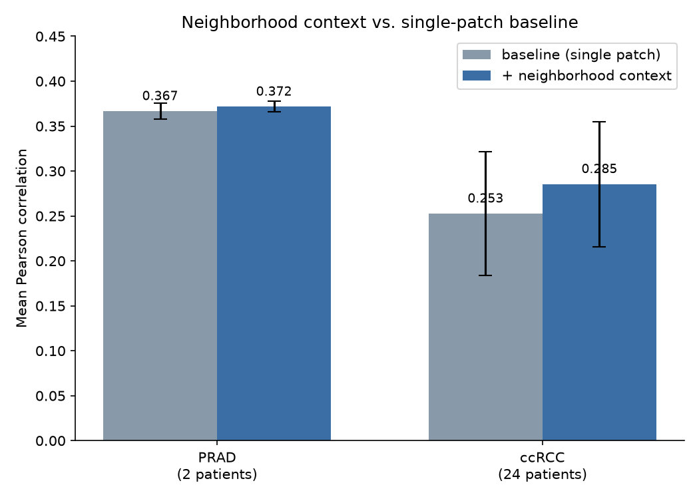

# Does spatial context help predict gene expression from histology?

I got interested in this after reading the HEST-1k paper and realizing how
much of computational pathology comes down to: can a model actually read
biology out of a picture of stained tissue? I wanted to get my hands dirty
with a real spatial transcriptomics dataset, on a real HPC cluster, rather
than just reading about the field - and I wanted to actually extend a paper's
method with my own idea, not just re-run someone else's code. This project is
the result: a from-scratch reimplementation of one piece of the HEST-Benchmark,
plus a genuine methodological fix I ran into along the way (mismatched gene
panels breaking the pooling step), plus my own hypothesis about whether
spatial neighborhood context improves prediction, tested on two different
cancer types. It's a small project, but everything in it is real - real data,
real compute, and a real (if modest) result.

This project builds on the HEST-Benchmark from the HEST-1k paper (Jaume et al.,
NeurIPS 2024, "HEST-1k: A Dataset for Spatial Transcriptomics and Histology
Image Analysis" - https://arxiv.org/abs/2406.16192, data/code at
https://github.com/mahmoodlab/hest).

The original benchmark predicts a spot's gene expression using only that one
spot's own H&E patch. I wanted to test something the paper doesn't do: does
knowing what the *surrounding* tissue looks like help predict a spot's
expression, on top of the patch itself?

I ran this on two tasks from hest-bench: PRAD (prostate cancer, 23 Visium
samples from 2 patients) and ccRCC (clear cell renal cell carcinoma, 24
Visium samples from 24 patients).

## Setup

- Data: `MahmoodLab/hest-bench` on HuggingFace
- Patch encoder: ResNet50, ImageNet pretrained, frozen (this is the paper's
  "ResNet50 (IN)" baseline - no gated model access needed to run this)
- Regression: PCA (256 components) -> Ridge, same as the paper's main result
- Evaluation: patient-stratified cross validation using the splits shipped
  with hest-bench (2 folds for PRAD, 6 folds for ccRCC) - a patient's spots
  never appear on both sides of a fold
- Metric: Pearson correlation per gene, averaged across genes, then averaged
  and reported as mean +/- std across folds

Everything ran on O2 (Harvard Medical School's HPC cluster). PRAD ran fine
interactively on CPU. ccRCC (bigger cohort, bigger samples) needed an sbatch
job to avoid getting killed by the login node's compute limits, and needed
enough memory headroom for pooling counts across mismatched gene panels
(more on that below).

## What I changed vs. the paper

**1. Gene selection.** The paper ranks genes by variance of log1p counts and
keeps the top 50. When I ran that as written, the list was dominated by
ribosomal protein genes (RPS*/RPL*) and mitochondrial genes (MT-*) - these
are expressed at high levels in every cell regardless of tissue biology, so
they have large absolute variance without being biologically specific. I
added a filter that drops these before ranking, so the top 50 is actually
things like KLK3 (PSA), TMPRSS2, NKX3-1, MSMB in PRAD, or VEGFA, COL1A1,
NDUFA4L2 in ccRCC - genes that mean something specific for that tissue. This
is a standard step in single-cell/spatial analysis, I just added it here
since the raw benchmark recipe doesn't do it.

Effect of this alone on PRAD, same folds, same everything else:

| gene selection            | mean Pearson | std    |
|----------------------------|-------------:|-------:|
| original (ribo/mito kept)  | 0.3321       | 0.0227 |
| filtered (ribo/mito dropped)| 0.3666      | 0.0089 |

Filtering out housekeeping genes improved the average and noticeably
tightened the spread across folds. The 0.3321 number is also close to what
the paper itself reports for PRAD with ResNet50 (~0.31), which is a decent
sign the reimplementation is faithful before I started changing anything.

**2. Handling mismatched gene panels.** ccRCC's samples weren't all
processed against the same reference: some samples report 36,601 genes,
others only 17,943 (a strict subset). The paper's gene-pooling step assumes
every sample lists identical genes in identical order, which breaks the
moment that's not true. I changed gene pooling to take the intersection of
genes present in every sample, and changed downstream gene lookups to
resolve by gene name per sample rather than by a shared column position -
important because two samples can have completely different column
orderings for the same gene, and a positional index would silently pull the
wrong values otherwise. This is a real-world data inconsistency, not
something specific to my code; a benchmark meant to handle "legacy,
inconsistent ST data" (the paper's own framing) needs to handle it.

**3. Neighborhood context (the actual experiment).** For each spot, I found
its 6 nearest neighboring spots by pixel coordinate (6, because Visium spots
sit on a hexagonal grid, so 6 is the natural number of immediate neighbors),
averaged their embeddings, and concatenated that average onto the spot's own
embedding - so the regression sees the spot's own patch plus a summary of
what's happening around it, rather than replacing or diluting the spot's own
signal.

## Results

**PRAD** (2 folds, 2 patients):

| variant                    | mean Pearson | std    |
|-----------------------------|-------------:|-------:|
| baseline (single patch)     | 0.3666       | 0.0089 |
| + neighborhood context      | 0.3716       | 0.0059 |

**ccRCC** (6 folds, 24 patients):

| variant                    | mean Pearson | std    |
|-----------------------------|-------------:|-------:|
| baseline (single patch)     | 0.2526       | 0.0690 |
| + neighborhood context      | 0.2854       | 0.0696 |

## Honest read on the results

On PRAD alone, neighborhood context helped a little (+0.005) - real
direction, both folds agreed, but with only 2 folds I wasn't confident that
wasn't just noise landing favorably.

ccRCC is a better test: 24 patients, 6 folds instead of 2. There, the
improvement was +0.033 - about 6x larger than on PRAD - and it held in every
single fold (all 6 improved, none got worse). That consistency across
independently held-out patients is a much stronger signal than PRAD alone
could give me. Taken together, I'm fairly confident neighborhood context is
giving a real, if modest, boost here, not just noise.

I'd still call this a modest effect in absolute terms (a few points of
Pearson correlation), not a transformative one. It's also only tested with
one neighbor count (k=6) and one aggregation method (simple averaging) - I
haven't checked whether a different k or a learned (rather than averaged)
aggregation does better, which would be the natural next thing to try.

## Repo layout

    src/
      gene_selection.py         - pool counts across samples (handles mismatched
                                   gene panels), pick top 50 HVGs, ribo/mito filter
      baseline_regression.py    - PCA+Ridge regression, patient-stratified CV,
                                   Pearson scoring, name-based gene lookup per sample
      neighbors.py              - k-NN lookup on spot coordinates, neighborhood
                                   aggregation
    scripts/
      inspect_sample.py                 - sanity check one sample's patch/expression
                                           alignment
      extract_embeddings.py             - embed one sample's patches with ResNet50
      extract_embeddings_batch.py       - same, looped over every sample in a task
      build_context_embeddings.py       - build neighbor-aggregated embeddings for
                                           a task
      run_baseline.py                   - run the baseline benchmark on a task
      compare_gene_filters.py           - baseline vs. ribo/mito-filtered gene
                                           selection
      compare_context_vs_baseline.py    - the main experiment: baseline vs.
                                           neighborhood context
    run_ccrcc.sbatch                    - SLURM job running the full ccRCC pipeline

## Reproducing this

    conda create -n gitproj python=3.11
    conda activate gitproj
    pip install numpy pandas scipy scikit-learn h5py anndata scanpy
    pip install torch torchvision timm huggingface_hub

    hf auth login   # needs a free HuggingFace account + access request to
                    # MahmoodLab/hest-bench (auto-approved)

    # small task, runs fine interactively
    hf download MahmoodLab/hest-bench --repo-type dataset --include "PRAD/*" --local-dir data
    python scripts/extract_embeddings_batch.py --patches_dir data/PRAD/patches --out_dir data/PRAD/embeddings
    python scripts/build_context_embeddings.py --task_dir data/PRAD --k 6
    python scripts/compare_context_vs_baseline.py --task_dir data/PRAD

    # bigger task, use the sbatch job instead of running interactively
    hf download MahmoodLab/hest-bench --repo-type dataset --include "CCRCC/*" --local-dir data
    sbatch run_ccrcc.sbatch

## License

This repo's own code is released under the MIT license (see LICENSE) - use
it, fork it, adapt it. That's separate from the underlying HEST-1k data,
which stays under the original authors' CC BY-NC-SA 4.0 license (see below):
non-commercial use, share-alike, with attribution. If you use the data itself
outside of this repo, that license is what governs it, not mine.

## Credit

All data, the original benchmark design, and the HEST-Library belong to the
HEST-1k authors (Jaume et al., Mahmood Lab, NeurIPS 2024), released under
CC BY-NC-SA 4.0. This repo is my own reimplementation of one piece of their
benchmark plus my own modifications on top of it, for a class/portfolio
project - not affiliated with the original authors.
